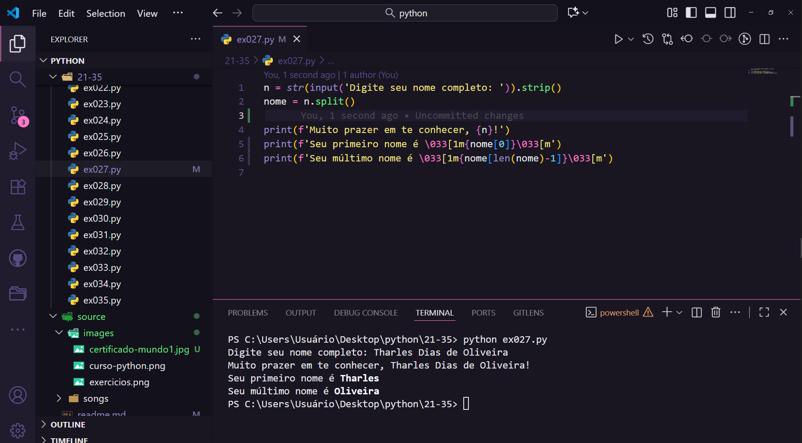
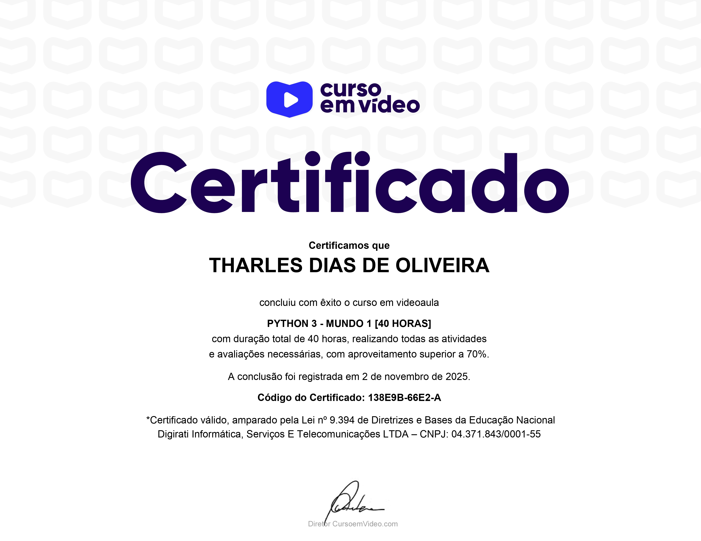

# Lista de exercícios resolvidos em Python🐍

Este é um curso que foi disponibilizado pelos apoiadores gafanhotos e gratuito aos demais alunos, composto por aulas explicativas gravadas e listas de exercícios com resolução tanto no site do curso em vídeo, quanto no canal do curso em vídeo no YouTube.

## 📘 Descrição

Esta é a minha resolução da lista de exercícios propostos pelo curso em vídeo de python.

## 📄 Certificado: Python 3 - Mundo 1

 Investi mais de 40 horas no curso Python 3 - Mundo 1, ministrado por Gustavo Guanabara, obtendo uma nota superior a 70%, o que me permitiu emitir o meu primeiro certificado de Python.

## 💻 Tecnologias

- Python 3

