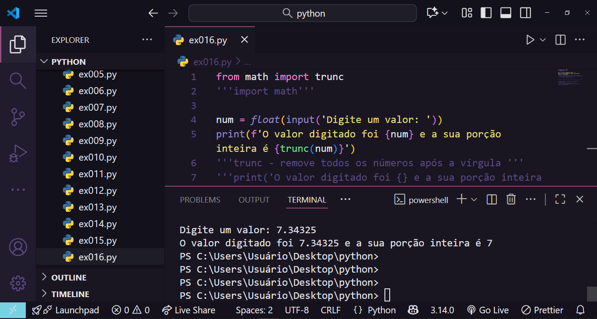

# 🐍 | Lista de exercícios resolvidos em Python by Professor Gustavo Guanabara

Este é um curso gratuito composto por aulas explicativas gravadas e listas de exercícios com resolução tanto no site do curso em vídeo, quanto no canal do curso em vídeo no YouTube.

## 📘 Descrição

Esta é a minha resolução da lista de exercícios propostos pelo professor Guanabara no curso em vídeo de python.

## 💻 Tecnologias

- Python 3

